# OCRaaP


OCRaaP (Optical Character Recognition as a Program) is a handwritten, two-dimensional programming language designed for maximum ease of use and portability (all you need is some paper and a pen).

# In this repo

In this repo you will find the following files and folders:

* `interpreter.py` - A CLI interpreter with a built-in debugger.

  * Run: `python interpreter.py -h` for options

* `model.py` - Represents the neural network classifier and provides an interface to facilitate prediction and training.

* `image_parser.py` - Performs symbol detection on a image.

* `generate.py` - A command line tool to help generate testing and training data for the classifier.

* `data_loader.py` - A tool to load and process images that the classifier will use for training or prediction.

# Overview

An OCRaaP program is first drawn on paper and then scanned in to the computer where it is fed into an interpreter.

The code pointer is a 2D projectile that moves around the paper and triggers operations upon encountering symbols similar.

Execution begins at `sad` and moves towards the nearest symbol. Once it reaches this symbol, it executes the operation and attempts to continue moving in the same direction towards the next nearest symbol within ~20 degrees of its current heading. If there is no nearby symbol, the code pointer will perform a "long jump" where it will attempt to move to the closest symbol that is directly along the current heading.

*Note: the user is advised to make the code path as clear as possible since the interpreter can be quite a pain in the ass*

When the code pointer reaches `Dead`, it halts execution.

Operations are conducted on an operand stack that holds unbounded integers.

# Examples

The following images are examples of valid OCRaaP programs:

| Name | Description | Program |
| --- | --- | --- |
| Hello World | prints the string `Hello World!` to the console | 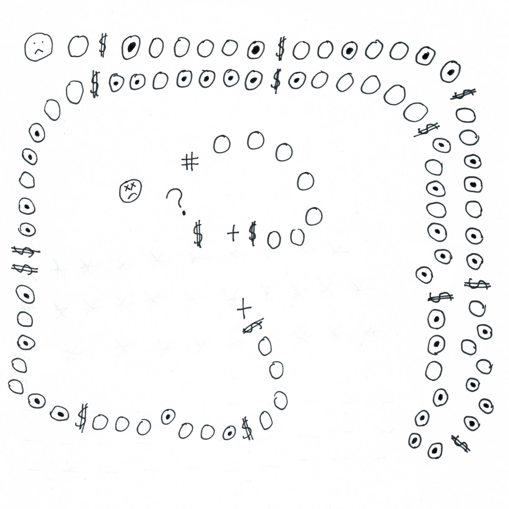 |
| Echo | reads a string from the console and then prints it back |  |

# Symbols

### Global

| Symbol | Name | Description |
| --- | --- | --- |
|  | `Sad` | The initial execution point of the program. If there are more than one of these, the program is invalid. |
|  | `Dead` | Code execution stops here |
| 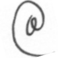 | `At` | Reads a character from the input stream and pushes it to the stack |
| 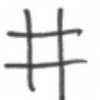 | `Hash` | Pops a character from the stack and writes it to the output stream |

### Conditional

| Symbol | Name | Description |
| --- | --- | --- |
| 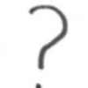 | `Conf` | Pops a value and checks if it is zero. If it is, code execution is deflected ~60 deg counter clockwise. Otherwise, code execution is deflected ~60 deg clockwise. |

### Constant

Constants can be pushed to the stack in binary notation termiated by a `Dollar`. Operands begin at the least significant bit.

For example, the following path of symbols would push 13 (0b1101) to the stack:

```
Dot -> Empty -> Dot -> Dot -> Dollar
```

| Symbol | Name | Description |
| --- | --- | --- |
|  | `Empty` | Writes a binary 0 |
| 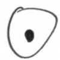 | `Dot` | Writes a binary 1 |
| 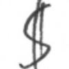 | `Dollar` | Terminates const loading |

### Arithmetic

| Symbol | Name | Description |
| --- | --- | --- |
|  | `Plus` | pop b, pop a, push a+b |
| 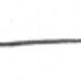 | `Dash` | pop b, pop a, push a-b |

# Errors

### 1x - Parse Time

| Code | Name | Description |
| --- | --- | --- |
| 10 | too sad | Found duplicate `sad` symbol |
| 11 | too happy | Could not find `sad` symbol |

### 2x - Runtime

| Code | Name | Description |
| --- | --- | --- |
| 20 | stack underflow | tried to pop from empty stack |
| 21 | already sad | tried to execute a `sad` symbol after start |

# How it works

### Classifier

The intepreter in this repository uses a convolutional neural network classifer that was trained using TensorFlow on a few dozen of each symbol. Training symbols were generated in every orientation so the classifier should be rotation invariant. It reached about `97%` accuracy on a separate validation set.

*Note: users are advised to draw symbols with great precision so as not to confuse the classifier*

The network structure is as follows:

```
INPUT: 40x40x1 grayscale images

Convolutional Layer 1: 40x40x6 (kernel: 6x6, stride: 1)
Convolutional Layer 2: 20x20x12 (kernel 5x5, stride: 2)
Convolutional Layer 3: 10x10x24 (kernel 4x4, stride: 2)

Fully Connected + dropout: 200

Softmax Output: 10
```

Training is done in batches of 200 using TensorFlow's implementation of the [Adam Optimizer](https://www.tensorflow.org/api_docs/python/tf/train/AdamOptimizer) to minimize cross entropy.

*during training, pkeep for the fully connected + dropout layer is set to 0.75*

### Training Data

In order to generate training and testing data, you can use the `generate.py` CLI which will perform segmentation on an input image and allow you to discard symbols that were segmented incorrectly.

For example, the following image (from `source/`) was used to generate training data for the `dollar` symbol:

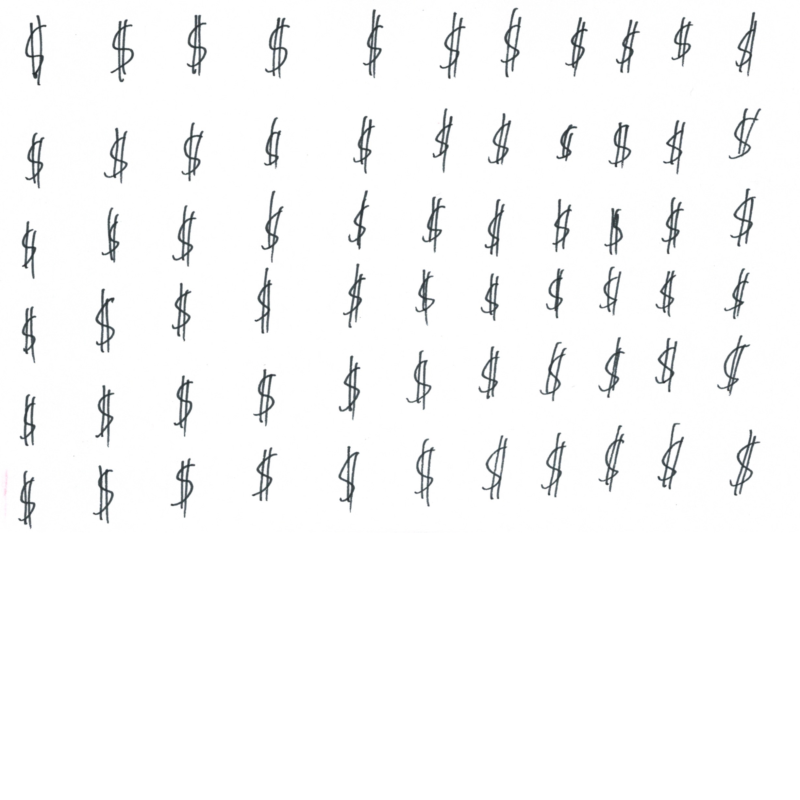

The script will then crop each symbol to  and generate an image at each 15 degree rotation like so:

|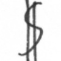|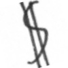|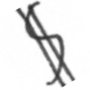|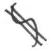||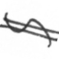|
|---|---|---|---|---|---|
|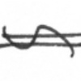|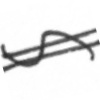||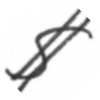|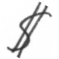|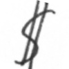|
|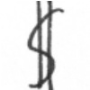|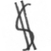|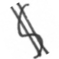|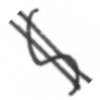|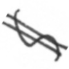|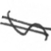|
|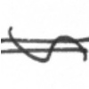|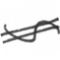|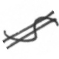|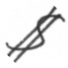|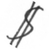||
