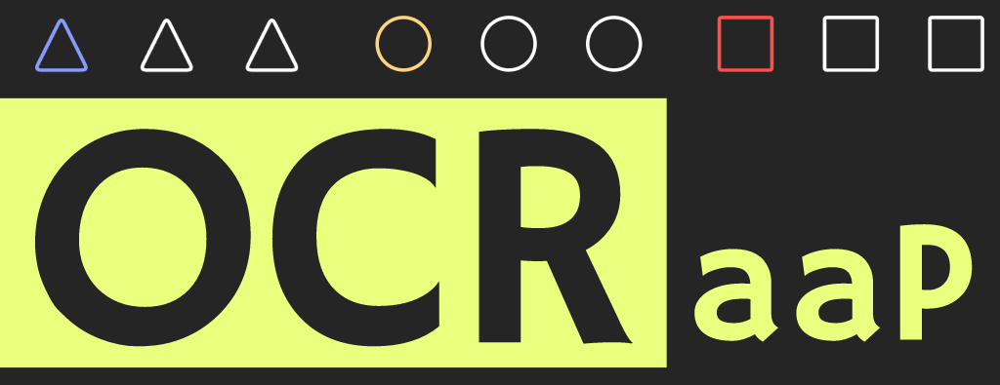

# OCRaaP



OCRaaP (Optical Character Recognition as a Program) is a handwritten, two-dimensional programming language designed for maximum ease of use and portability (all you need is some paper and a pen).

# In the repo

In this repo you will find the following files and folders:

* `interpreter.py` - The main interpreter. See `RUNNING.md` for instructions on use.

* `model.py` - Represents the neural network classifier and provides a class to facilitate prediction and training.

* `image_parser.py` - Performs symbol detection on a image.

* `generate.py` - A command line tool to help generate testing and training data for the network.

* `data_loader.py` - A tool to load and process images that the classifier will use for training or prediction.

# Overview

An OCRaaP program is meant to be handwritten and scanned in to the interpreter as a square image.

The code pointer is a 2D projectile that moves around the code space and triggers operations upon encountering symbols. The code space is layed out on a torus to allow the code pointer to wrap around the edges.

Execution begins at `Sad` and moves towards the nearest symbol. Once it reaches this symbol, it executes the operation and attempts to continue moving in the same direction towards the next nearest symbol. However, it will search in a range +- 20 degrees from its heading to accomidate (literal) loops.

If the code pointer reaches `Dead`, it halts execution.

Operations act on an operand stack which holds integer values of any range.

# Symbols

### Global

| Symbol | Name | Description |
| --- | --- | --- |
| 🙁 | `Sad` | The initial execution point of the program. If there are more than one of these, the program is invalid. |
| 😵 | `Dead` | Code execution stops here |
| @ | `At` | Reads a character from the input stream and pushes it to the stack |
| # | `Hash` | Pops a character from the stack and writes it to the output stream |

### Conditional

| Symbol | Name | Description |
| --- | --- | --- |
| ? | `Conf` | Pops a value and checks if it is zero. If it is, code execution is deflected ~60 deg counter clockwise. Otherwise, code execution is deflected ~60 deg clockwise. |

### Constant

Constants can be pushed to the stack in binary notation termiated by a `Dollar`. Operands begin at the least significant bit.

For example, the following path of symbols would push 13 (0b1101) to the stack:

```
Dot -> Empty -> Dot -> Dot -> Dollar
```

| Symbol | Name | Description |
| --- | --- | --- |
| ◯ | `Empty` | Writes a binary 0 |
| ◉ | `Dot` | Writes a binary 1 |
| $ | `Dollar` | Terminates const loading |

### Arithmetic

| Symbol | Name | Description |
| --- | --- | --- |
| + | `Plus` | pop b, pop a, push a+b |
| - | `Dash` | pop b, pop a, push a-b |

# Errors

### Parse Time

| Code | Name | Description |
| --- | --- | --- |
| 10 | too sad | Found duplicate `sad` symbol |
| 11 | too happy | Could not find `sad` symbol |

### Runtime

| Code | Name | Description |
| --- | --- | --- |
| 20 | stack underflow | tried to pop from empty stack |
| 21 | already sad | tried to execute a `sad` symbol after start |
